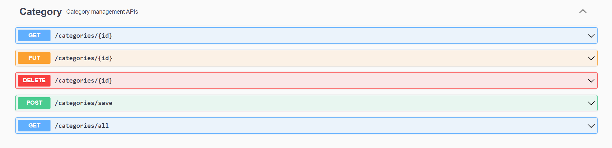
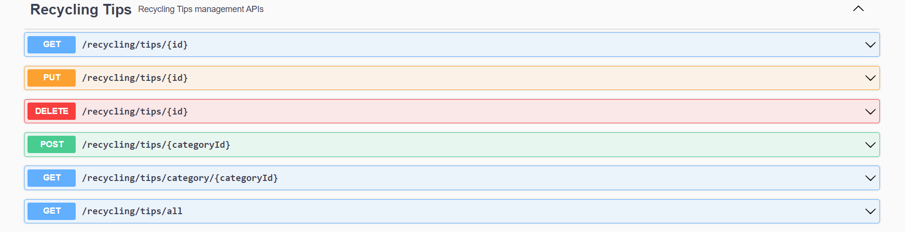
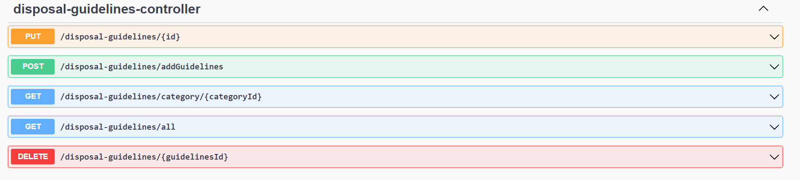
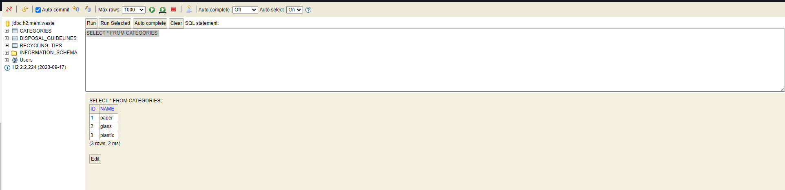
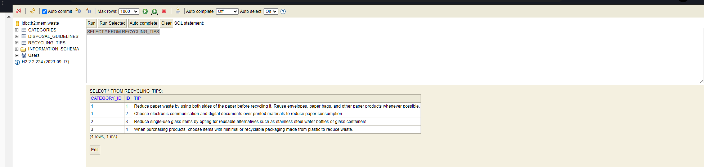
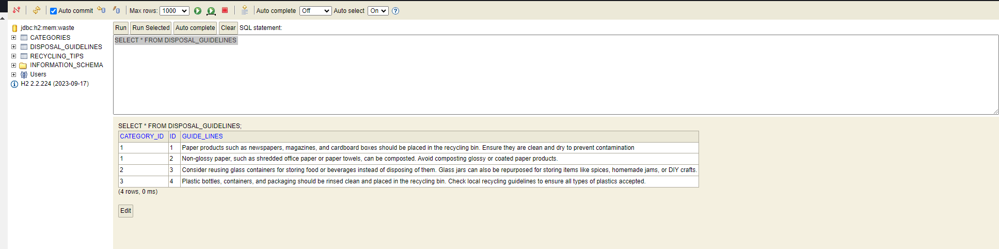

# Waste Sorting Mobile Application

## Background

At Enviro365, we're passionate about environmental sustainability. That's why we're developing a waste sorting mobile application. Our goal is to educate users about proper waste disposal techniques and encourage recycling habits.

As a recent graduate developer at Enviro365, I've been tasked with implementing REST endpoints to facilitate communication between the frontend and backend systems of the application.

## Scenario

I'm part of a dedicated team working on the waste sorting mobile application at Enviro365. Our team is committed to creating a user-friendly and informative application that empowers users to make environmentally conscious decisions.

The application will offer various features, including:

- Waste category lookup
- Retrieval of disposal guidelines
- Display of recycling tips

My role involves designing and implementing REST endpoints using Spring Boot to enable data exchange between the frontend mobile application and the backend server.

## Implementation Details

To run swagger ui:
## http://localhost:8081/api/v1/swagger-ui/index.html#

### REST Endpoints for Category

### REST Endpoints for Recycling Tips

### REST Endpoints for Disposal Guide Lines

## H2 Data Table

## Implementation Details

To run h2 database:
### http://localhost:8081/api/v1/h2-console/login.jsp?jsessionid=9e65e3fa4b7eab5d712da007941fe8ad

